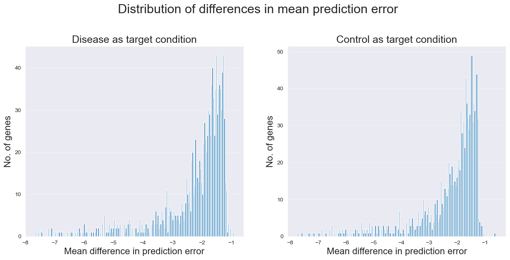
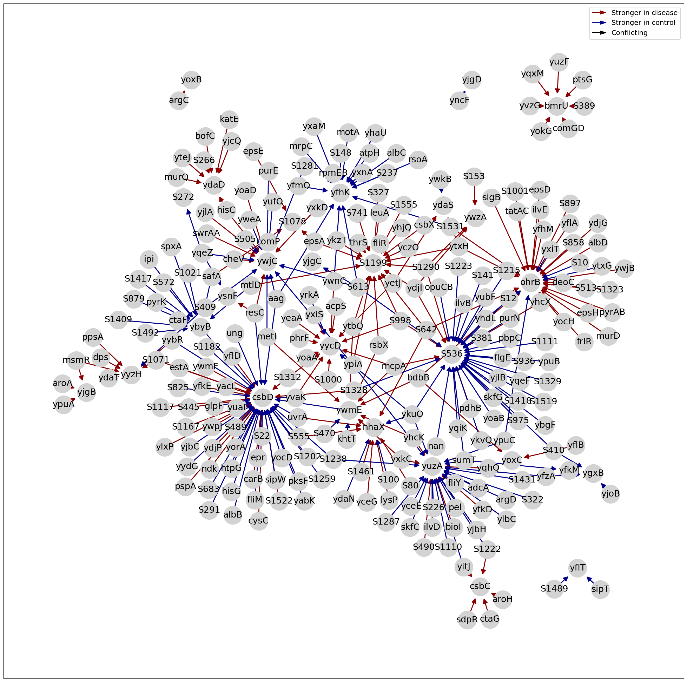
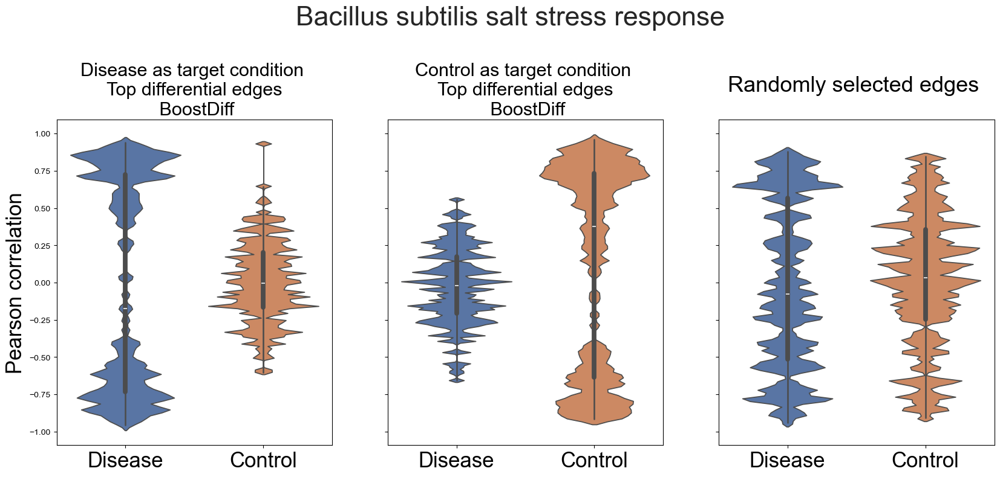

# BoostDiff 
BoostDiff (Boosted Differential Trees) - Tree-based Inference of Differential Networks from Gene Expression Data


## General info
BoostDiff is a tree-based method for inferring differential networks from large-scale transcriptomics data 
by simultaneously comparing gene expression  from two biological conditions (e.g. disease vs. control conditions). 
The network is inferred by building modified AdaBoost ensembles of differential trees as base learners. BoostDiff modifies regression trees to use differential variance improvement (DVI) as the novel splitting criterion. 

## Installation

We create the conda environment from the environment.yml provided and install the package from git:

```
git clone https://github.com/gihannagalindez/boostdiff_inference.git && cd boostdiff_inference

conda env create --name bdenv --file environment.yml
conda activate bdenv

pip install .
```


## Data input

BoostDiff accepts two filenames corresponding to gene expression matrices from the disease and control conditions.
Each input is a tab-separated file. The rows correspond to genes, while the columns correspond to samples. Note that the two inputs should have the same set of features, where the first column should be named "Gene".

Disease expression data:
| Gene  |   Disease1   |   Disease2  | Disease3  | 
|-------------------|-----------|-----------|------|
| ACE2   | 0.345  | 0.147  |0.267 | 
| APP   | 0.567  | 0.794  | 0.590 | 

Control expression data:
| Gene  |   Control1   |   Control2  | Control3  | 
|-------------------|-----------|-----------|------|
| ACE2   | 0.084  | 0.147  |0.91 | 
| APP   | 0.567  | 0.794  | 0.590 | 

## Parameters:
1. **run**(file_disease, file_control, output_folder, n_estimators, \
          n_features, n_subsamples, keyword=keyword, n_processes=n_processes)

- `file_disease`: *string*, path to the disease expression data 
- `file_control`: *string*, path to the control expression data 
- `output_folder`: *string*, the folder where the output will be generated
- `n_estimators`: *int*, the no. of trees to be built in the modified AdaBoost ensemble
- `n_features`: *int*, the no. of regulators (predictor genes/features) to be used
- `n_subsamples`: *int*, the no. of bootstrapped samples to be used per condition (disease samples and control samples) when building the tree ensemble
- `min_samples_leaf`: *int (default = 2)*, the minimum no. of samples in a leaf
- `min_samples_split`: *int (default = 6)*, the minimum no. of samples required to split an internal node
- `max_depth`: *int (default = 2)*, the maximum depth of a differential tree; max_depth=0 means tree stumps will be built
- `min_samples`: *int (default = 15)*, the minimum no. of samples required per condition (disease samples and control samples) 
- `learning_rate`: *float (default = 1.0)*, the minimum no. of samples required per condition (disease samples and control samples) 
- `loss`: *string (default = "square")*, the loss used for AdaBoost {"square","exponential","linear"}
- `n_processes` *int (default = 1")*, for parallel computing 
- `keyword` *string*, keyword used for naming the output files
- `regulators`: the string 'all' if all genes can be considered potential predictors or a list of gene names to be used as predictors
- `normalize` *string or bool*:, if False, then no normalization will be performed; default is "unit_variance" normalization

## Datasets

If you want to analyze datasets that are available on the Gene Expression Omnibus (GEO) database, you can use GEOquery in R. Depending on the study and formatting of the raw data, you might need to map the genes to the desired genes IDs, filter, or preprocess them. Here is an example on how to download the Crohn's disease dataset that was used in the paper:

```R
library(GEOquery)
library(biomaRt)
library(dplyr)

# ====================Crohn's disease===================
# Data source: GEO database

# Get dataset
gset <- getGEO("GSE126124", GSEMatrix =TRUE)
res = pData(gset[[1]])
df_expr = data.frame(exprs(gset[[1]]))

# Get data from colon tissue
df_tiss = res[res$`tissue:ch1` == "colon biopsy",]

names_ctrl = rownames(df_tiss[df_tiss$`disease type:ch1` == "Control",])
names_crohns = rownames(df_tiss[df_tiss$`disease type:ch1` == "Crohn's Disease",])

# Map and aggregate
# Retrieve the mappings from biomart
mart <- useMart(biomart = "ENSEMBL_MART_ENSEMBL", host = "https://www.ensembl.org", path = "/biomart/martservice", dataset = "hsapiens_gene_ensembl")
hgnc_mapping <- getBM(attributes = c("affy_hugene_1_0_st_v1", "hgnc_symbol"), filters = "affy_hugene_1_0_st_v1", values=rownames(df_expr), mart = mart)
indicesLookup <- match(rownames(df_expr), hgnc_mapping[["affy_hugene_1_0_st_v1"]])
df_expr$Gene <- hgnc_mapping[indicesLookup, "hgnc_symbol"]
df_new <- df_expr %>% mutate_if(is.character, na_if, c('')) %>% na.omit
df_new <- df_new %>% group_by(hgnc) %>% summarise_all("mean")

# Create expression data for Crohn's and control
df_crohns = df_new[, c("hgnc", names_crohns)]
df_ctrl = df_new[, c("hgnc", names_ctrl)]

# Write expression data
file_crohns = "df_crohns.txt"
file_ctrl_crohns = "df_ctrl_crohns.txt"
write.table(df_crohns, file = file_crohns, append = FALSE, quote = FALSE, sep = "\t", row.names = FALSE)
write.table(df_ctrl_crohns, file = file_ctrl_crohns, append = FALSE, quote = FALSE, sep = "\t", row.names = FALSE)
```

## Running BoostDiff 

Import the BoostDiff package:

```python
from boostdiff.main_boostdiff import BoostDiff
```

The ideal number of samples per condition as input to BoostDiff would be at least 30 samples each. For real transcriptomics datasets, we recommend to set a relatively low number of base learners, e.g. set `n_estimators=50`, so that 50 adaptively boosted differential trees will be built to avoid overfitting. 

The Crohn's disease dataset is large and will need a high-performance computing cluster to run in reasonable time. So in this example, we run BoostDiff on the smaller sample simulated data provided in `data` > `simulated_data`. We also provide a sample script for running the B. subtilis salt stress response data in `tutorial` > `01_boostdiff_on_bsubt.py`. 

```python

file_disease = "/path/to/boostdiff_inference/data/expr_disease.txt"
file_control = "/path/to/boostdiff_inference/data/expr_control.txt"
output_folder = "/path/to/output/"

n_estimators = 50
n_features = 50
n_subsamples = 50
keyword = "test"
n_processes = 2

model = BoostDiff()
model.run(file_disease, file_control, output_folder, n_estimators, \
          n_features, n_subsamples, keyword=keyword, n_processes=n_processes)

```

BoostDiff will output two subfolders, each containing two txt files.
<br />
<br /> Note that BoostDiff runs the algorithm twice:
<br /> Run 1: The disease condition will be used as the target condition (with control condition as baseline). Results will be generated in the subfolder "disease".
<br /> Run 2: The control/healthy condition will be used as the target condition (with disease condition as baseline).  Results will be generated in the subfolder "control".
<br /> <br /> In each subfolder, the first txt file shows the data for the mean difference in prediction error between the disease and control samples after training the boosted differential trees. The second txt file contains the raw output network.

##  Postprocessing: Filtering and Visualization

For postprocessing, we will create a different conda environment using the environment_vis.yml:

```
conda create --name bd_post --file environment_vis.yml
conda activate bd_post
```

The notebook containing the code for filtering and visualization can be found in `tutorial` > `02_tutorial_visualization.ipynb`. To obtain the final differential network, the raw network should be filtered for target genes in which BoostDiff found a more predictive model for the target condition. This additional step is crucial and part of the pipeline, as a trained model will not always be more predictive of a target condition. 

For edge filtering, we recommend to start with `p=3` to filter for 3rd percentile of the top target genes with the largest differences in prediction errors between the disease and control conditions.

```python
import networkx as nx
import pandas as pd
import matplotlib.pyplot as plt
import numpy as np
import seaborn as sns
import os

# Load functions for filtering and visualization
import sys
sys.path.insert(1, "../filtering_visualization")
from postprocessing import *


output_folder = "../outputs_tutorial" # where the BoostDiff outputs are located
keyword = "saltvsmm" # specify the keyword used when running BoostDiff

file_diff_dis = os.path.join(output_folder, "disease", "differences_{}.txt".format(keyword))
file_diff_con = os.path.join(output_folder, "control", "differences_{}.txt".format(keyword))

# Specify the output files containing the network after running BoostDiff
file_net_dis = os.path.join(output_folder, "disease", "boostdiff_network_{}.txt".format(keyword))
file_net_con = os.path.join(output_folder, "control", "boostdiff_network_{}.txt".format(keyword))

plot_histogram(output_folder, keyword)
```



```python
# Filter the network
df_dis = filter_network(file_net_dis, file_diff_dis, p=3, n_top_edges=150)
df_con = filter_network(file_net_con, file_diff_con, p=3, n_top_edges=150)

# Map the gene IDs to gene names for visualizing the network
file_mapping = "../data/bsubt_map.txt"
df_map = pd.read_csv(file_mapping, sep="\t")
df_map = df_map[["<strong>ID</strong><strong>","GeneSymbol</strong><strong>"]]
df_map.columns = ["id","symbol"]
dict_map = dict(zip(df_map.id, df_map.symbol))
dict_map = {int(float(k)):v for k,v in dict_map.items()}

df_dis = df_dis.replace(dict_map)
df_con = df_con.replace(dict_map)

# Plot the resulting network using pygraphviz layouts
# You can use any of the layouts: gv_layout = ["fdp","neato","sfdp"]
file_grn = r"../outputs_tutorial/diff_grn.svg"
plot_grn(df_dis, df_con, layout="graphviz_layout", gv_layout="fdp", show_conflicting=True, 
         fontsize=18, filename=None)
```


```python
# Plot correlation distributions per target condition

# Load the expression data
file_dis_expr = r"../data/b_subtilis_salt/exprs_salt.txt"
file_con_expr = r"../data/b_subtilis_salt/exprs_smm.txt"

# Get correlations of top edges and randomly selected edges
df_dis, df_con, df_rand = get_correlations(file_dis_expr, file_con_expr, output_folder, 
                                           percentile=3, keyword=keyword, index="Gene", 
                                           n_edges=150)

# Visualize using violin plot
title = "Bacillus subtilis salt stress response"
file_grn = r"../outputs_tutorial/corr_dists_salt_stress.svg"
plot_corr_dists(df_dis, df_con, df_rand, title=title, filename=file_grn, bw_adjust=0.07)
```


## Citation 

Galindez, G. G., List, M., Baumbach, J., Blumenthal, D. B., & Kacprowski, T. (2022). Inference of differential gene regulatory networks from gene expression data using boosted differential trees. bioRxiv. doi: https://doi.org/10.1101/2022.09.26.509450.

##  References

[1] Pedregosa, F., et al. (2011). Scikit-learn: Machine learning in Python. the Journal of machine Learning research, 12, 2825-2830.
<br /> [2] Huynh-Thu, V. A., Irrthum, A., Wehenkel, L., & Geurts, P. (2010). Inferring regulatory networks from expression data using tree-based methods. PloS one, 5(9), e12776. <br />
[3] Bhuva, D. D., Cursons, J., Smyth, G. K., & Davis, M. J. (2019). Differential co-expression-based detection of conditional relationships in transcriptional data: comparative analysis and application to breast cancer. Genome biology, 20(1), 1-21.

## Contact 
Gihanna Galindez: gihanna.galindez@plri.de
